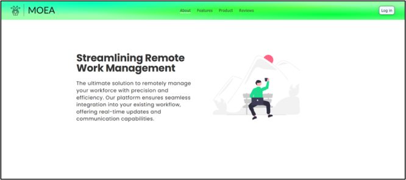

# Managing Offsite Employee Activities

## Overview
The **Managing Offsite Employee Activities** project is a comprehensive tool designed to streamline task and team management for organizations. It provides features such as real-time location tracking, role-based access control, task delegation, and efficient communication, making it an ideal solution for businesses aiming to enhance productivity and transparency among offsite employees.

This project leverages modern web technologies and a user-centric design to ensure a seamless experience for all user roles, including managers, team leaders, and employees.

---

## Features
### Core Features:
- **Task Management**: Create, update, and delegate tasks efficiently.
- **Team Management**: Organize team structures and roles dynamically.
- **Real-Time Location Tracking**: View the live locations of employees.
- **Communication**: Integrated chat functionality for seamless interaction.
- **File Sharing**: Upload, download, and manage organizational files securely.
- **Role-Based Access Control (RBAC)**: Customize access levels for users based on their roles.

### Additional Features:
- **Dynamic UI**: Customizable interfaces for different roles.
- **Performance Reports**: Monitor team and individual performance with analytics.
- **Authentication and Security**: User authentication with Supabase, ensuring data privacy.

---

## Technologies Used
### Frontend:
- React (UI Development)
- React Router (Navigation)
- React Leaflet (Interactive Maps)
- BoxIcons & Material Symbols (Visual Elements)

### Backend:
- Supabase (Database and Authentication)
- Resend.com (Email Management)

### Tools:
- Visual Studio Code (Development)
- Figma (Design Wireframes)
- Miro & LucidChart (Flowcharts)
- Firefox DevTools (Testing)

## Usage

### User Roles:
1. **Chief**: Full control over organizational structure, task management, and performance analytics.
2. **Manager**: Manage teams, approve task changes, and monitor performance.
3. **Secretary**: Create tasks, assign employees, and track task progress.
4. **Team Leader**: Manage team-specific tasks and view performance.
5. **Worker**: Update task statuses, add sub-tasks, and report issues.

### Key Operations:
- **Access Dashboard**: A central hub for all operations.
- **Task Management**: Assign tasks, update statuses, and track deadlines.
- **File Management**: Upload and share organizational documents.
- **User Management**: Add, edit, and manage user roles and permissions.

---

## Challenges and Future Enhancements
### Challenges:
- Row-Level Security (RLS) complexities in Supabase.
- Email limitations with Supabase, resolved using Resend.com.
- Authentication and database integration issues.

### Future Enhancements:
- Implement an interactive tutorial for onboarding.
- Expand mobile compatibility for better accessibility.
- Add localization and undo functionality for key actions.
- Improve RLS policies for enhanced security.

---

## Acknowledgments
Special thanks to:
- **University of Portsmouth** for project support.
- Open-source tools and libraries that facilitated the development.

---

## License
This project is licensed under the MIT License. See the [LICENSE](LICENSE) file for details.
